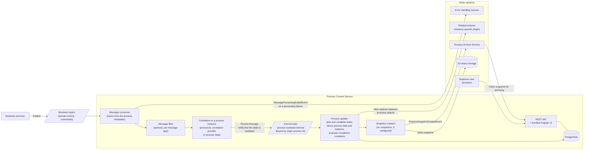

# Getting Started

This guide describes how to set up an instance of the Process Context Service (PCS) for a business
application. For the process definition itself see [Process Templates](process-templates.md), for the
available properties see [Configuration](configuration.md).

## How it works

The PCS consumes the messages declared in its process templates, keeps the state of the process instances up
to date, and publishes what it has derived from them:



The internal topic decouples the ingestion from the state computation: it is keyed by the origin process ID,
so the updates of one process instance are processed serially while different instances are processed in
parallel. This keeps the transactions short and makes the parallelism independent of the partitioning of the
business topics — see [Architecture](architecture.md#asynchronous-notifications-and-eventual-consistency).

Note that the PCS is strictly passive: it never decides which activities are to be executed and never
triggers one. `ProcessSnapshotCreatedEvent` is the only message it publishes on its own; anything else
reaching other systems is produced by an instance-specific `RelationListener`.

## 1. Create a service instance

The PCS is published as a **library**. Every business application creates its own instance, i.e. a source
code repository containing:

- a POM referencing the process context library and the plugin API,
- the configuration files (`application-<env>.yml`),
- optionally Java code for conditions and plugins,
- the process templates and their translations.

If the instance is **not** part of a multi-module project, use `jeap-process-context-service-instance`
directly as the Maven parent. This makes the explicit `jeap-process-context-scs` and
`jeap-process-context-plugin-api` dependencies unnecessary:

```xml
<parent>
    <groupId>ch.admin.bit.jeap</groupId>
    <artifactId>jeap-process-context-service-instance</artifactId>
    <version>use-the-latest-version-here</version>
    <relativePath/>
</parent>
```

Inside a multi-module project, declare the dependencies explicitly:

```xml
<dependencies>
    <dependency>
        <groupId>ch.admin.bit.jeap</groupId>
        <artifactId>jeap-process-context-scs</artifactId>
        <version>${jeap-process-context-service.version}</version>
    </dependency>
    <dependency>
        <groupId>ch.admin.bit.jeap</groupId>
        <artifactId>jeap-process-context-plugin-api</artifactId>
        <version>${jeap-process-context-service.version}</version>
    </dependency>
</dependencies>
```

> In multi-module projects, make sure the `jeap-spring-boot-parent` version used by your parent matches the
> one used by the PCS dependencies.

The main class of the application is `ch.admin.bit.jeap.processcontext.Application`.

## 2. Order the Kafka topics

The PCS produces and consumes messages, so the following topics have to exist for every instance:

| Configuration key (`jeap.processcontext.kafka.topic.*`) | Naming proposal                          | Usage                                                                                        |
|---------------------------------------------------------|------------------------------------------|----------------------------------------------------------------------------------------------|
| `process-outdated-internal`                             | `<system>-process-processoutdated-internal` | Internal. Controls the maximum internal parallelism of the PCS — increase the partition count under high load. |
| `process-snapshot-created`                              | `<system>-process-snapshotcreated`       | `ProcessSnapshotCreatedEvent`. Only required if process snapshots are configured.             |

Additionally, the PCS needs at least read permission on every topic carrying the messages referenced in its
process templates.

### Scaling and concurrency

The PCS scales with the number of instances and the number of partitions of the consumed topics:

- The partition count of the **business application topics** controls the parallelism while consuming
  incoming messages. Scaling is usually not necessary here, as those messages are consumed very quickly.
- The partition count of the **`process-outdated-internal` topic** controls the parallelism of the internal
  processing (state updates). Increasing it is recommended for instances under very high load.

The maximum possible concurrency is `number of instances × listener concurrency`:

```yaml
spring:
  kafka:
    listener:
      concurrency: 3
```

## 3. Order the user role

| Semantic role                     | Usage                                                                     |
|-----------------------------------|---------------------------------------------------------------------------|
| `<system>_@processinstance_#view` | Role for users of the process context UI. Must be assigned to the users.  |

The system name has to be configured in both of these properties:

- `jeap.security.oauth2.resourceserver.system-name`
- `jeap.processcontext.frontend.system-name`

## 4. Configure the application

A minimal configuration of an instance looks as follows:

```yaml
server:
  servlet:
    context-path: /process-context

spring:
  application:
    name: jme-process-context-scs
  jpa:
    properties:
      hibernate:
        default_schema: data
  datasource:
    hikari:
      schema: ${spring.jpa.properties.hibernate.default_schema}
  flyway:
    # Flyway automatically creates the default schema if it does not exist
    default-schema: ${spring.jpa.properties.hibernate.default_schema}

jeap:
  messaging:
    kafka:
      error-topic-name: jme-messageprocessing-failed
      system-name: JME
      service-name: ${spring.application.name}
  processcontext:
    kafka:
      topic:
        process-outdated-internal: "jme-process-event-received"
        process-snapshot-created: "jme-process-snapshotcreated"
    frontend:
      client-id: "process-context"
      system-name: "jme"
      silent-renew: true
      auto-login: true
      renew-user-info-after-token-renew: true
      logout-redirect-uri: "https://localhost:8080/logout"
    objectstorage:
      snapshot-retention-days: 3
  security:
    oauth2:
      resourceserver:
        system-name: "jme"
```

See [Configuration](configuration.md) for the complete property reference.

## 5. Create the process templates

The PCS loads its process templates from the classpath, matching the pattern
`process/templates/*.json`. The structure of a template is described in
[Process Templates](process-templates.md).

### JSON schema support in the IDE

A JSON schema for process templates is available at
`jeap-process-context-repository-template-json/src/main/schema/process-template-schema.json`. Registering it
in the IDE provides code completion and validation while editing templates. In IntelliJ IDEA, open a process
template and use *No JSON schema* in the status bar → *New Schema Mapping*:

- **Schema file or URL**: the schema file above
- **File path pattern**: `**/src/main/resources/process/templates/*.json`

## 6. Instantiate processes

Process instances are created by **messages** (domain events or commands). Set `triggersProcessInstantiation`
or `processInstantiationCondition` on the corresponding message declaration in the process template, see
[Process instantiation](process-templates.md#process-instantiation).

## 7. Optional steps

- **Custom conditions, payload and reference extractors** — see [Process Templates](process-templates.md).
- **Relation listener** — implement `RelationListener` as a Spring bean to be notified about newly
  discovered relations between business objects, see [Relation patterns](process-templates.md#relation-patterns).
- **Message filters** — ignore irrelevant messages of a given type, see
  [Message filters](configuration.md#message-filters).
- **Encrypted Kafka records** — the PCS can consume records encrypted with jeap-messaging / jeap-crypto.
  This usually only requires the Vault URL and system name to be configured, plus the `jeap-vault-starter`
  and `jeap-crypto-vault-starter` dependencies.
- **Housekeeping and template migration scheduling** — see [Configuration](configuration.md).
